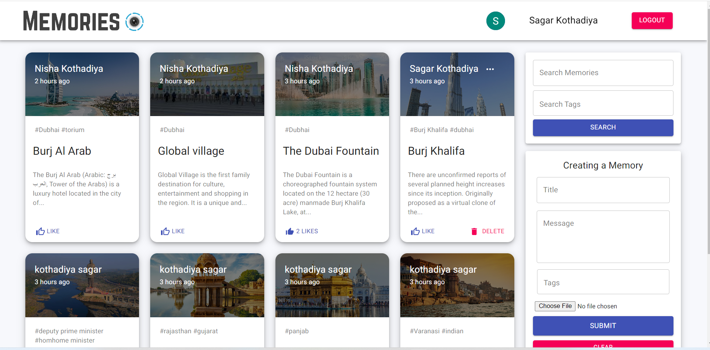
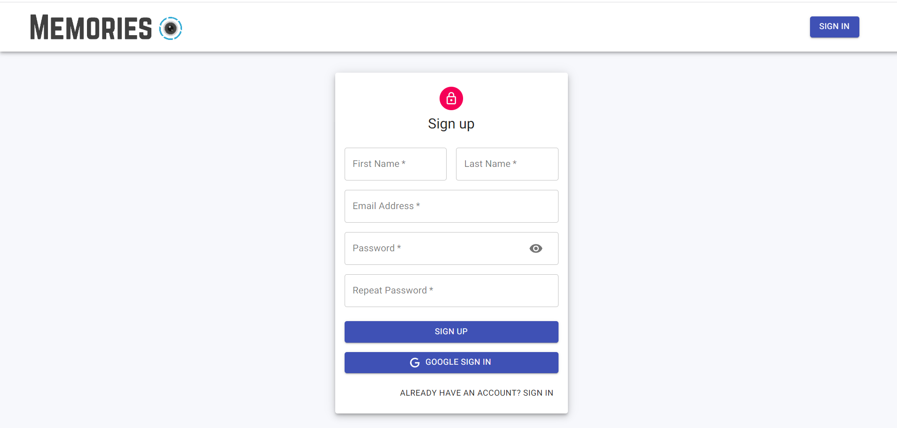
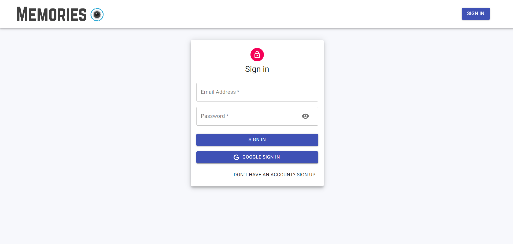
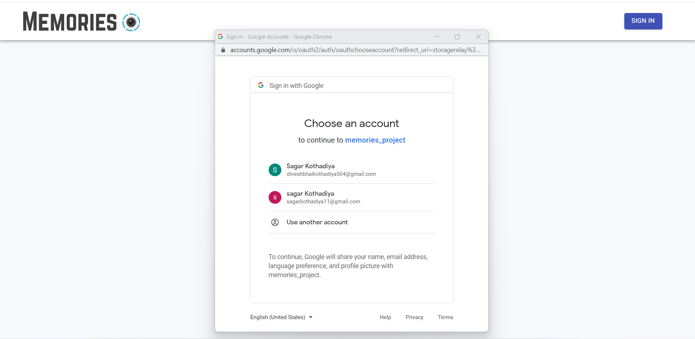
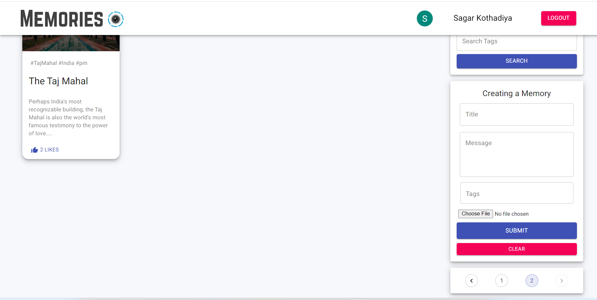
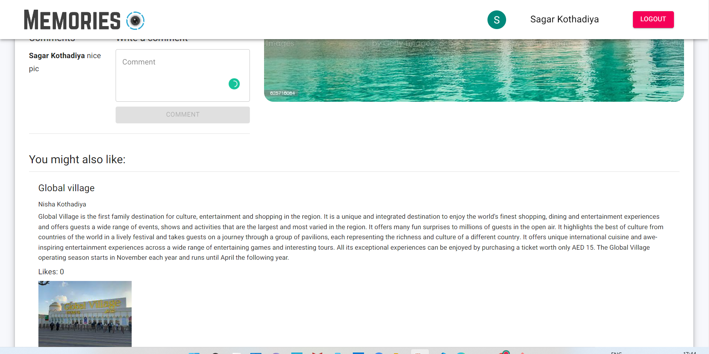

# memories_social media app

 it is a simple social media app that allows users to post interesting events that happened in their lives.

 ## Deployed Site

[Memories_social_Media_App](https://memories-social-mediaapp.netlify.app)

 ## Features

- Login with Email (JWT) + Google OAuth Authentication
- Pagination.
- Comments.
- Like event.
- Create Update and Delete  memories.
- Responsive for all devices.
- Recommended Posts.
- search memories.

## Tech Stack

- HTML | CSS | JavaScript | React | MongoDB | NodeJS | Express | JWT

### Libraries Used

- Material Ui

 **Memories Page**

 **Sign up Page**

 **Sign In Page**

 **Login With Google**

 **Pagination**

**Posts-Details Page**

 **RecommendedPosts Page**

